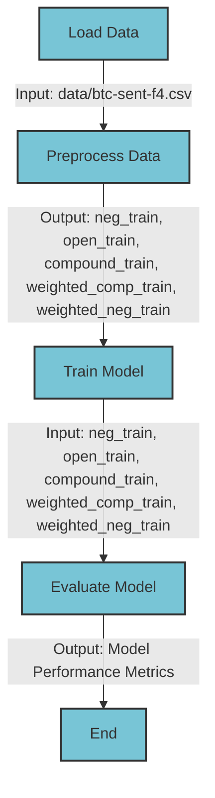

```mermaid

graph TD

A[Load Data] -->|Input: data/btc-sent-f4.csv| B[Preprocess Data]
B -->|Output: neg_train, open_train, compound_train, weighted_comp_train, weighted_neg_train| C[Train Model]
C -->|Input: neg_train, open_train, compound_train, weighted_comp_train, weighted_neg_train| D[Evaluate Model]
D -->|Output: Model Performance Metrics| E[End]

style A fill:#78C5D6,stroke:#333,stroke-width:2px;
style B fill:#78C5D6,stroke:#333,stroke-width:2px;
style C fill:#78C5D6,stroke:#333,stroke-width:2px;
style D fill:#78C5D6,stroke:#333,stroke-width:2px;
style E fill:#78C5D6,stroke:#333,stroke-width:2px;
```