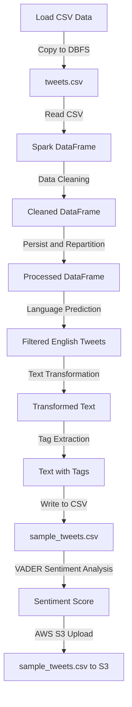

```mermaid

graph TD
    A[Load CSV Data] -->|Copy to DBFS| B[tweets.csv]
    B -->|Read CSV| C[Spark DataFrame]
    C -->|Data Cleaning| D[Cleaned DataFrame]
    D -->|Persist and Repartition| E[Processed DataFrame]
    E -->|Language Prediction| F[Filtered English Tweets]
    F -->|Text Transformation| G[Transformed Text]
    G -->|Tag Extraction| H[Text with Tags]
    H -->|Write to CSV| I[sample_tweets.csv]
    I -->|VADER Sentiment Analysis| J[Sentiment Score]
    J -->|AWS S3 Upload| K[sample_tweets.csv to S3]
```